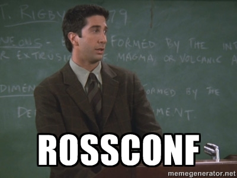

ROSS logo
====
The basic logo is a simplified R shape, based on the public contributions grid used on GitHub. The basis logo has no hidden meaning. It is not loaded with extra information and as such is hardly never used.

Loaded logo
======
With a simple programmable algorithm, we can load every logo with visual information that corresponds to the individual names, locations, etcetera. you would want to add.

Grid logic
======
The R shape is not 'just' a collection of squares. It's a simple grid that gives space to every letter of our alphabet, a word count, and a count of additional glyphs.

COLOR LOGIC
======
The VI consists of (besides gray) two separate bright colors. The red tint, which is a reference to the Ruby programming language, and the green tint (referring to the Github grid).
The color intensity shows the 'density' of a letter. For example: in the word 'Vienna', all letters are used once, except for the 'n', which is used twice.
The most used letter is the base for the color grid.
The green (which shows the amount of words in the name and the amount of glyphs (dashes, points, comma's etc.) follows the 'red logic'.

EXAMPLE
======
In this example we see that: There's two types/hues of red. So the maximum amount of the same letter is two.
In this word we have:
d=1 e=2 f=1 l=1 o=2 r=2 s=1
Amount of words = 2 Amount of glyphs = 0
This is Floor Drees's unique logo.

And because [alicetragedy](http://github.com/alicetragedy/) needed to be funny: 

